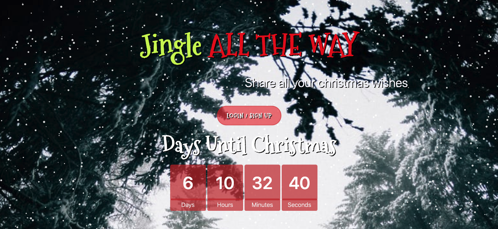
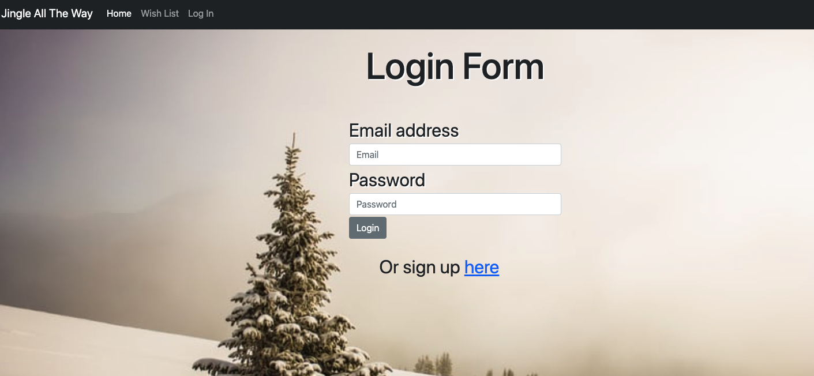
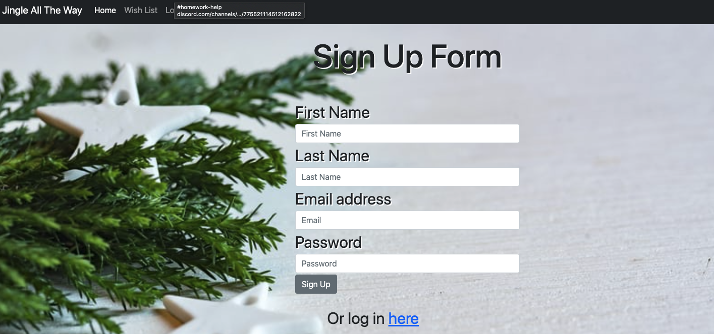
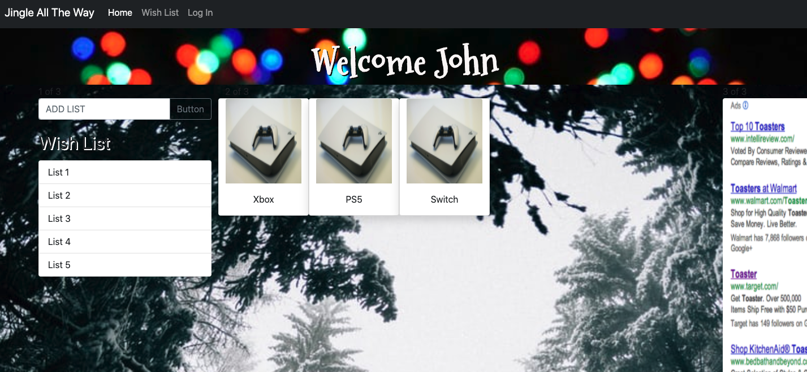
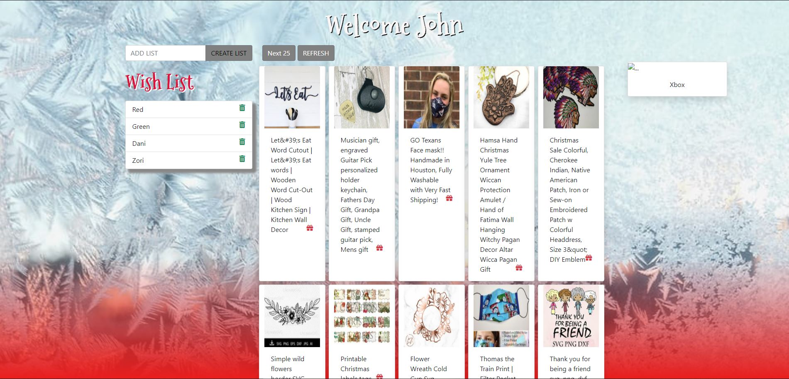

### PROJECT TITLE: 	Jingle All The Way

When the page loads- I see a login/signup button and a Christmas Countdown.

###

When I click on login/signup page I am directed to a login form, if user doesn’t have a user login, they will create one.

###

Once the user logs in they will be directed to a member specific view which displays a create list form, lists that have been made, a suggestion of 25 gifts.

###

When the user selects a list from the left, the list shows on the right side of the screen. User is able to add more items to their list. User can also refresh and get 25 new items to select from. Christmas music also plays in the background. 
User is able to delete lists when finished. 

USER STORY: As a family member/friend I would like to be able to create lists online so that I am able to stay organized. I would like to see suggested gifts and be able to click on them to add to a list. I would like to be able to see photos and a URL link that takes me to Etsy where there is a description of the item. This will make my holiday shopping much easier.

### TASKS:
Create HTML with navbar, login/signup, Christmas countdown. On the Member page there is a create list button, wish list, items pulled from the API, refresh button, list contents on the right side. 
Used Bootstrap for html skeleton looks
JavaScript: created variables, ajax calls to the API, functions to bring information onto the page.

# Technologies, Languages, Frameworks being used:

* API-
* JavaScript- used to dynamically change the html and store-user input
* HTML- used to create elements on the DOM
* CSS- used for styling html elements on the page.
* Query- used for event listeners of elements as well as to store and recall variables in local storage to be displayed dynamically in HTML on the page. 
* Bootstrap- Used for creating responsive structure and styling for this app. 
* Local storage- used to keep the variables and their values.
* Sequelize-promise based Node.js ORM for MySQL
* Passport- authentication middleware for Node.js
* Bcrypt- password-hashing function 
* Heroku- PaaS that runs the application in the cloud
* JawsDB- create, edit and run queries with SQL in JawsDB dashboard
* Express-Node.js application framework
* Dotenv-loads environment variables from a .env
* Axios- Javascript library used to make HTTP requests from node.js
* Snow particles on first page- Author : Vincent Garreau  - vincentgarreau.com
MIT license: http://opensource.org/licenses/MIT
Demo / Generator : vincentgarreau.com/particles.js
GitHub : github.com/VincentGarreau/particles.js
