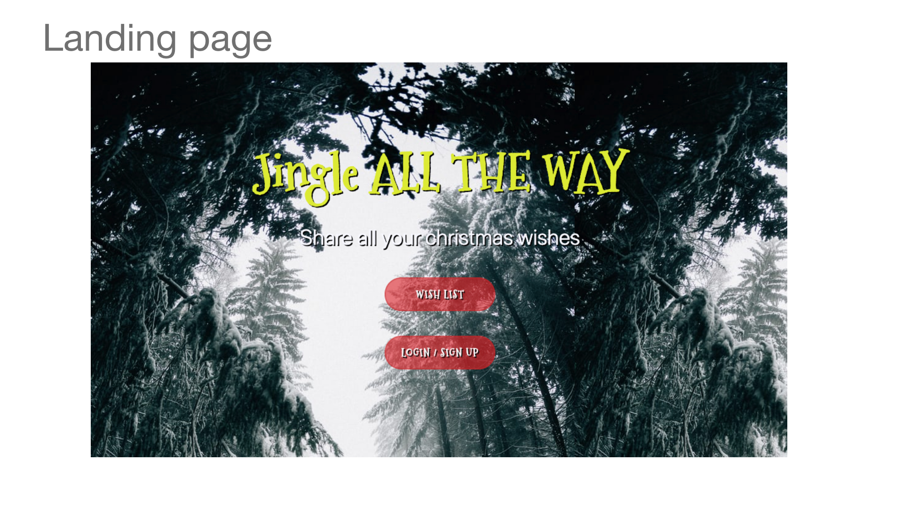
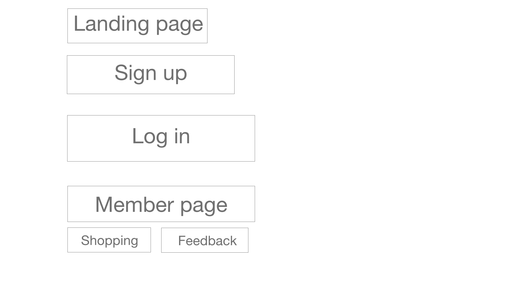
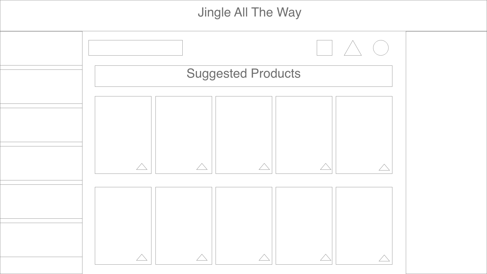

# Jingle All The Way

This webpage allows the user to create a shopping list from items available on https://www.etsy.com.



# Usage

The user will have to either login or create an account to get access to the site.



#

Once logged in, The user will be presented with their member specific view which would display their shooping lists and any feedbacks they have left.


#

```
If the user selects a list, they are then presented with a screen that allows them to Add items, View items or Update their current items.
```



# Technologies Used

The following technologies were used in the development:

<li> HTML</li>
<li> CSS</li>
<li> JavaScript</li>
<li> Express</li>
<li> Sequelize</li>
<li> Heroku</li>
<li> JawsDB</li>
<li> Passport</li>
<li> bcrypt</li>
<li>dotenv</li>
<li>axios</li>
